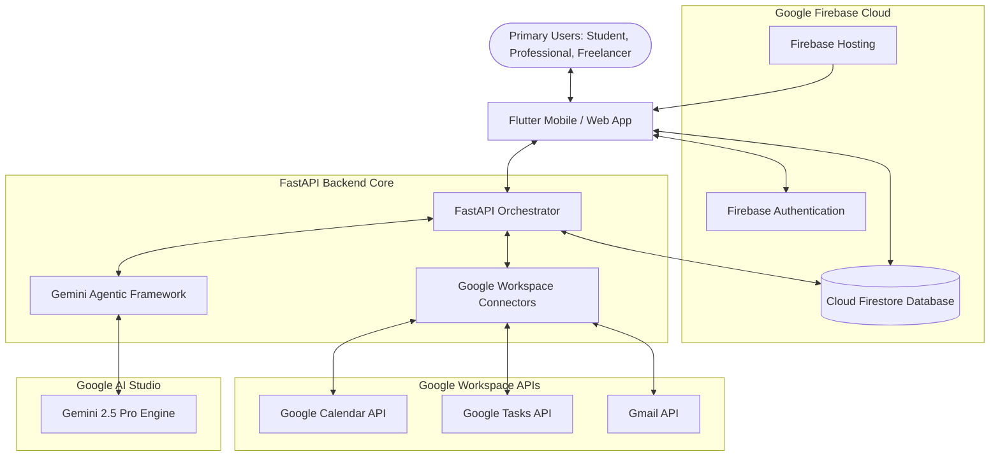

# 🚨 LifeSaver AI: Prevent Missed Deadlines Before They Happen

[](file:///d:/ANIYA%20PROJ/LifeSaverAI/frontend)
[](file:///d:/ANIYA%20PROJ/LifeSaverAI/backend)
[](file:///d:/ANIYA%20PROJ/LifeSaverAI/backend/app/agents/agents.py)
[](file:///d:/ANIYA%20PROJ/LifeSaverAI/backend/app/core/firebase.py)

**LifeSaver AI** is the world's first autonomous personal productivity companion designed to prevent deadline failures through proactive, multi-agent reasoning. Unlike traditional calendars and to-do lists, which are passive reminders of what you've *already* missed or forgotten, LifeSaver AI operates as an agentic guardrail. It connects directly with user workspace accounts (Gmail and Google Calendar), tracks real-time workloads, dynamically calculates deadline risks, schedules dedicated focus blocks, and intervenes directly when it detects procrastination.

---

## 📖 Table of Contents

- [🏛️ System Architecture](#️-system-architecture)
- [🤖 The 7-Agent Core Pipeline](#-the-7-agent-core-pipeline)
- [📂 Project Structure](#-project-structure)
- [🚀 Quick Start & Local Setup](#-quick-start--local-setup)
  - [Prerequisites](#prerequisites)
  - [FastAPI Backend Setup](#fastapi-backend-setup)
  - [Flutter Frontend Setup](#flutter-frontend-setup)
- [⚙️ Configuration & Environment Variables](#️-configuration--environment-variables)
- [🛡️ Security & Token Encryption](#️-security--token-encryption)
- [🛣️ Product Roadmap](#️-product-roadmap)

---

## 🏛️ System Architecture

LifeSaver AI integrates four core layers:
1. **Flutter Mobile/Web Client:** Constructed using Material Design 3, providing rich dashboards, real-time focus sessions, visual calendars, and an accountability coach chat.
2. **FastAPI Backend Orchestrator:** An asynchronous Python service that manages endpoint routing, processes user logic, and handles Google Workspace API syncing.
3. **Gemini 2.5 Pro Engine:** Orchestrates 7 specialized agents utilizing structured JSON schemas for stable, reasoning-backed intelligence.
4. **Firebase Platform:** Uses Firebase Authentication for identity management and Cloud Firestore for low-latency, real-time document storage.

### Data Flow & Component Mapping



---

## 🤖 The 7-Agent Core Pipeline

The backend implements 7 distinct, collaborative agents (defined in [agents.py](file:///d:/ANIYA%20PROJ/LifeSaverAI/backend/app/agents/agents.py)) that process information as an automated workflow pipeline:

```
[ User Input / Gmail / Calendar Event ]
                  │
                  ▼
         ┌─────────────────┐
         │    Agent 1:     │ ◄─── Parses raw language into structured tasks
         │ Task Understand │      with effort estimates and dependency maps.
         └────────┬────────┘
                  │ (Structured Tasks)
                  ▼
         ┌─────────────────┐
         │    Agent 2:     │ ◄─── Evaluates risk factor combinations and
         │ Risk Prediction │      calculates a Miss Probability Score.
         └────────┬────────┘
                  │ (Risk Metrics)
                  ▼
         ┌─────────────────┐
         │    Agent 3:     │ ◄─── Prioritizes backlog using Eisenhower
         │  Priority Opt.  │      matrix & danger ratings.
         └────────┬────────┘
                  │ (Ranked Task Queue)
                  ▼
         ┌─────────────────┐
         │    Agent 4:     │ ◄─── Automatically schedules focus blocks
         │ Schedule Plan.  │      within open windows in working hours.
         └────────┬────────┘
                  │ (Time Block Schedules)
                  ▼
         ┌─────────────────┐
         │    Agent 5:     │ ◄─── Evaluates critical risk margins and pushes
         │  Intervention   │      actionable, friction-free alerts.
         └────────┬────────┘
                  │ (Action Triggers / Delay Detection)
                  ▼
         ┌─────────────────┐
         │    Agent 6:     │ ◄─── Triggers on snooze/procrastination. Breaks
         │ Account. Coach  │      tasks into <10min micro-steps.
         └────────┬────────┘
                  │ (Micro-Task Breakdowns / Chat prompts)
                  ▼
         ┌─────────────────┐
         │    Agent 7:     │ ◄─── Instantly builds recovery plans and updates
         │ Recovery Agent  │      downstream dependency dates if missed.
         └─────────────────┘
```

1. **Task Understanding Agent:** Parses natural text commands, voice notes, or incoming emails, producing structured tasks containing title, description, category, dependencies, and relative deadlines.
2. **Risk Prediction Agent:** Calculates a dynamic *Miss Probability Score* (0.0 to 1.0) and isolates critical risk factors based on current task effort, overlapping events, and user workload.
3. **Priority Optimization Agent:** Dynamically ranks pending tasks based on deadline urgency, effort density, and risk metrics, using Eisenhower-inspired calculations.
4. **Schedule Planning Agent:** Maps high-priority tasks into open spots on the user's calendar, taking into account working hours constraints and preventing overlaps with pre-existing events.
5. **Intervention Agent:** Identifies tasks nearing deadline limits with elevated risk and sends rich, friction-reducing notifications to nudge users into action.
6. **Accountability Coach Agent:** Steps in when the user delays a block or repeatedly presses "Snooze." It breaks down complex workloads into 2-4 small, sub-10-minute micro-tasks to lower the barrier to entry.
7. **Recovery Agent:** Handles missed deadlines. If a task slips, the agent recalculates downstream schedules, adjusts dependent tasks, and provides a clear recovery roadmap.

---

## 📂 Project Structure

```
LifeSaverAI/
├── backend/                             # Python FastAPI Orchestrator Service
│   ├── app/
│   │   ├── agents/
│   │   │   └── agents.py                # 7-Agent Core Implementations (Gemini API)
│   │   ├── api/
│   │   │   └── endpoints.py             # REST API Endpoint Routers (Tasks CRUD, Agents API)
│   │   ├── core/
│   │   │   ├── config.py                # Pydantic Settings & Environment Variables
│   │   │   └── firebase.py              # Firestore Connection & Local Mock DB Engine
│   │   ├── models/
│   │   │   └── schemas.py               # Pydantic Request/Response validation schemas
│   │   ├── services/
│   │   │   └── google_services.py       # Calendar, Gmail, Tasks Integration Service
│   │   └── main.py                      # FastAPI app entry point & CORS configuration
│   ├── Dockerfile                       # Container deployment definition
│   └── requirements.txt                 # Python packages list
│
├── frontend/                            # Cross-Platform Flutter Client App
│   ├── lib/
│   │   ├── screens/                     # Application Screen Components
│   │   │   ├── ai_chat_screen.dart      # Interactive Accountability Coach Chat interface
│   │   │   ├── analytics_screen.dart    # Task completion & focus score trends
│   │   │   ├── calendar_view_screen.dart# Rendered schedule blocks & calendar event sync
│   │   │   ├── dashboard_screen.dart    # Main command center layout (Stats, Risk Alerts, Notifications)
│   │   │   ├── focus_mode_screen.dart   # Interactive timed focus session widget
│   │   │   ├── onboarding_screen.dart   # Firebase onboarding & authentication mock
│   │   │   └── task_manager_screen.dart # Task listing & creation via Voice Extraction
│   │   ├── services/
│   │   │   ├── api_service.dart         # Flutter REST client for backend API communication
│   │   │   └── theme_helper.dart        # Core Material Design 3 theme styles & configurations
│   │   └── main.dart                    # Flutter app entry point (Provider & Routing setups)
│   └── pubspec.yaml                     # Flutter pub package definition
│
└── docs/                                # Technical Architectural Documentation
    ├── architecture.md                  # Detailed NoSQL Schemas & System Layouts
    ├── deployment.md                    # Cloud Run & Hosting commands
    ├── pitch.md                         # Presentation deck scripts & roadmap
    ├── sequence_diagrams.md             # Multi-agent transaction sequence diagrams
    └── wireframes.md                    # Detailed UI components layouts
```

---

## 🚀 Quick Start & Local Setup

### Prerequisites
- **Flutter SDK** (`>=3.0.0`)
- **Python** (`>=3.10`)
- **Firebase CLI** (For production sync and web hosting)
- **Google AI Studio API Key** (For Gemini LLM queries)

---

### FastAPI Backend Setup

> [!NOTE]
> The backend features **complete local fallback modes**. If Firestore credentials or a `GEMINI_API_KEY` are not configured, the service will run smoothly using an **in-memory database engine** and **structured mock agent pipelines**. This provides a zero-config developer onboarding experience!

1. Navigate to the backend directory:
   ```bash
   cd backend
   ```

2. Create a virtual environment:
   ```bash
   python -m venv venv
   ```

3. Activate the virtual environment:
   * **Windows (PowerShell):**
     ```powershell
     .\venv\Scripts\Activate.ps1
     ```
   * **macOS / Linux:**
     ```bash
     source venv/bin/activate
     ```

4. Install the required dependencies:
   ```bash
   pip install -r requirements.txt
   ```

5. Create a `.env` file inside the `backend` directory (see [Configuration](#️-configuration--environment-variables)).

6. Spin up the local development server:
   ```bash
   uvicorn app.main:app --reload --host 127.0.0.1 --port 8000
   ```

The Swagger interactive docs will be available at [http://127.0.0.1:8000/docs](http://127.0.0.1:8000/docs).

---

### Flutter Frontend Setup

1. Navigate to the frontend directory:
   ```bash
   cd frontend
   ```

2. Fetch pub packages:
   ```bash
   flutter pub get
   ```

3. Launch the application:
   * Run the app in your browser (Flutter Web):
     ```bash
     flutter run -d chrome
     ```
   * Run the app in a connected Emulator/Device:
     ```bash
     flutter run
     ```

*To connect the frontend to a specific backend server, update the `baseUrl` in [api_service.dart](file:///d:/ANIYA%20PROJ/LifeSaverAI/frontend/lib/services/api_service.dart) or change the API URL directly inside the application's **Settings Screen**.*

---

## ⚙️ Configuration & Environment Variables

Configure these settings inside `backend/.env` or export them as environment variables:

| Variable | Type | Description | Default / Fallback |
| :--- | :--- | :--- | :--- |
| `GEMINI_API_KEY` | String | Your API Key from Google AI Studio. | `placeholder_key` *(triggers mock agent output)* |
| `FIREBASE_PROJECT_ID` | String | The project ID of your Firebase console setup. | `lifesaver-ai` |
| `FIREBASE_CREDENTIALS_PATH` | String | Optional path to a service account JSON credentials file. | `None` *(triggers Application Default Credentials / local mock store)* |
| `ENCRYPTION_SECRET_KEY` | String | A 32-character AES secret key for securing Google OAuth tokens. | `supersecretencryptionkeylifesaver123` |

---

## 🛡️ Security & Token Encryption

- **Authentication Middleware:** The backend interceptor in [endpoints.py](file:///d:/ANIYA%20PROJ/LifeSaverAI/backend/app/api/endpoints.py#L28-L41) validates Firebase Authentication tokens via the Bearer protocol. It parses credentials securely, falls back to a test account if mock mode is on, and rejects unauthorized access.
- **Firestore Security Rules:** Access is restricted per user. No user can view, edit, or delete documents belonging to another UID. (See complete Firebase rules inside [deployment.md](file:///d:/ANIYA%20PROJ/LifeSaverAI/docs/deployment.md#L90-L125)).
- **OAuth Token Encryption:** The Google Calendar and Gmail access tokens are encrypted using AES-256 with the `ENCRYPTION_SECRET_KEY` before writing to Firestore, preventing credential exposure in the event of database access leaks.

---

## 🛣️ Product Roadmap

- **Phase 1: Hackathon MVP (Current Version)**
  - Dynamic 7-agent pipeline using Gemini 2.5 Pro.
  - Interactive Material Design 3 dashboard.
  - Interactive Focus Timer & calendar block visuals.
  - Fallback mockup engines for zero-dependency runs.
- **Phase 2: Platform Engagement**
  - Integrate workspace chat gateways (WhatsApp, Slack, MS Teams) to feed task queues.
  - Sync with Garmin / Apple Health endpoints to adapt focus scheduling with the user's circadian energy levels.
  - Browser plugin to fetch deadlines straight from Canvas / Blackboard.
- **Phase 3: Team-Level Optimization**
  - Team risk engines predicting milestone delays based on peer dependencies.
  - Multi-user schedule synchronizations.
  - Automatic task outsourcing recommendation triggers.

---

*LifeSaver AI - Defending your time, one autonomous intervention at a time.*
