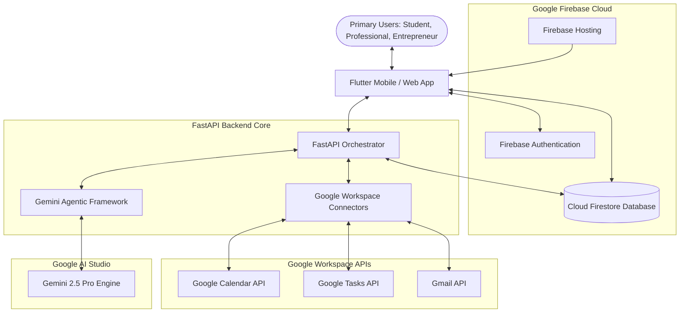

# LifeSaver AI: System Architecture & Database Design

This document details the complete system architecture, Firestore database schema, and agentic framework for **LifeSaver AI**.

---

## 1. System Architecture

LifeSaver AI uses a modern, distributed architecture combining:
1. **Flutter Frontend:** A cross-platform mobile and web client designed with Material Design 3.
2. **FastAPI Backend Orchestrator:** An asynchronous Python service managing API routing, user logic, external API integrations, and agent scheduling.
3. **Google AI Studio / Gemini 2.5 Pro:** The central intelligence layer responsible for task parsing, risk analysis, scheduling, prioritization, intervention, coaching, and recovery.
4. **Firebase Platform:**
   - **Firebase Authentication:** Handles secure user sign-in (Google Sign-In, Email/Password).
   - **Cloud Firestore:** A real-time NoSQL database storing users, tasks, schedules, habits, and risk logs.
   - **Firebase Hosting:** High-performance static hosting for the Flutter web client.
5. **Google Workspace APIs:**
   - **Google Calendar API:** Reading/writing calendar events.
   - **Gmail API:** Parsing potential commitments/deadlines from emails.
   - **Google Tasks API:** Synchronizing lists with native Google workloads.

### Architectural Diagram



---

## 2. Database Schema (Cloud Firestore)

Firestore is structured into the following root collections:

### 2.1. `users`
Stores user profile information, authentication metadata, settings, and authorization tokens.
* **Document ID:** `uid` (Firebase Auth UID)
```json
{
  "uid": "str (Document ID)",
  "email": "str",
  "displayName": "str",
  "createdAt": "timestamp",
  "updatedAt": "timestamp",
  "userType": "str (student | professional | entrepreneur | freelancer)",
  "settings": {
    "darkMode": "bool",
    "workingHours": {
      "start": "str (HH:MM)",
      "end": "str (HH:MM)"
    },
    "notificationPreferences": {
      "email": "bool",
      "push": "bool",
      "interventionSensitivity": "str (high | medium | low)"
    }
  },
  "tokens": {
    "googleOAuthAccessToken": "str (encrypted)",
    "googleOAuthRefreshToken": "str (encrypted)",
    "googleTokenExpiry": "timestamp"
  }
}
```

### 2.2. `tasks`
Stores tasks created by users or extracted by the Task Understanding Agent.
* **Document ID:** Auto-generated UUID
```json
{
  "id": "str (Document ID)",
  "userId": "str (Ref: users.uid)",
  "title": "str",
  "description": "str",
  "createdAt": "timestamp",
  "dueDate": "timestamp",
  "estimatedEffortMinutes": "int",
  "dependencies": "array of str (Ref: tasks.id)",
  "status": "str (pending | in_progress | completed | missed)",
  "category": "str (academic | work | personal | billing)",
  "externalSource": {
    "type": "str (gmail | google_tasks | gcal | none)",
    "id": "str (external event/task ID)"
  }
}
```

### 2.3. `goals`
Tracks long-term milestones.
* **Document ID:** Auto-generated UUID
```json
{
  "id": "str (Document ID)",
  "userId": "str (Ref: users.uid)",
  "title": "str",
  "category": "str (academic | career | personal)",
  "targetDate": "timestamp",
  "currentProgress": "float (0.0 to 1.0)",
  "relatedTaskIds": "array of str (Ref: tasks.id)",
  "createdAt": "timestamp"
}
```

### 2.4. `habits`
Maintains daily routines and streak logs.
* **Document ID:** Auto-generated UUID
```json
{
  "id": "str (Document ID)",
  "userId": "str (Ref: users.uid)",
  "title": "str",
  "frequency": "str (daily | weekly)",
  "streakCount": "int",
  "lastCompleted": "timestamp",
  "createdAt": "timestamp",
  "completionHistory": {
    "YYYY-MM-DD": "bool"
  }
}
```

### 2.5. `schedules`
Represents generated daily schedules mapping calendar events and tasks.
* **Document ID:** `userId_YYYY-MM-DD`
```json
{
  "userId": "str (Ref: users.uid)",
  "date": "str (YYYY-MM-DD)",
  "createdAt": "timestamp",
  "timeBlocks": [
    {
      "start": "timestamp",
      "end": "timestamp",
      "type": "str (focus_session | meeting | break | routine)",
      "relatedTaskId": "str (Ref: tasks.id | null)",
      "label": "str"
    }
  ]
}
```

### 2.6. `calendarEvents`
Cached Google Calendar events for quick backend scheduling computations.
* **Document ID:** Auto-generated UUID
```json
{
  "id": "str (Document ID)",
  "userId": "str (Ref: users.uid)",
  "externalEventId": "str",
  "summary": "str",
  "description": "str",
  "startTime": "timestamp",
  "endTime": "timestamp",
  "isConflict": "bool"
}
```

### 2.7. `aiRecommendations`
Interventions and recommendations generated by agents.
* **Document ID:** Auto-generated UUID
```json
{
  "id": "str (Document ID)",
  "userId": "str (Ref: users.uid)",
  "taskId": "str (Ref: tasks.id)",
  "recommendationType": "str (preemptive_intervention | procrastination_coach | recovery_plan)",
  "message": "str",
  "suggestedActions": [
    {
      "label": "str",
      "actionCode": "str (start_now | snooze | delegate | break_into_subtasks)",
      "payload": "map (JSON object)"
    }
  ],
  "status": "str (pending | accepted | dismissed)",
  "createdAt": "timestamp"
}
```

### 2.8. `focusSessions`
Tracks AI-supported deep work sessions.
* **Document ID:** Auto-generated UUID
```json
{
  "id": "str (Document ID)",
  "userId": "str (Ref: users.uid)",
  "taskId": "str (Ref: tasks.id)",
  "startTime": "timestamp",
  "endTime": "timestamp (null if active)",
  "plannedDurationMinutes": "int",
  "actualDurationMinutes": "int",
  "completedMilestones": "array of str",
  "focusScore": "int (0-100)"
}
```

### 2.9. `riskScores`
Saves historical data on deadline risk calculations for analytics and trends.
* **Document ID:** Auto-generated UUID
```json
{
  "id": "str (Document ID)",
  "userId": "str (Ref: users.uid)",
  "taskId": "str (Ref: tasks.id)",
  "riskScore": "float (0.0 to 1.0)",
  "factors": "array of str",
  "calculatedAt": "timestamp"
}
```

### 2.10. `notifications`
Actionable push notification payloads sent to users.
* **Document ID:** Auto-generated UUID
```json
{
  "id": "str (Document ID)",
  "userId": "str (Ref: users.uid)",
  "title": "str",
  "body": "str",
  "isRead": "bool",
  "createdAt": "timestamp",
  "actionPayload": {
    "screen": "str",
    "params": "map"
  }
}
```

### 2.11. `progressLogs`
Aggregated logs for metrics dashboard calculations.
* **Document ID:** `userId_YYYY_WW` (WW represents the week number)
```json
{
  "userId": "str",
  "year": "int",
  "week": "int",
  "completedTasksCount": "int",
  "missedTasksCount": "int",
  "focusHoursAccumulated": "float",
  "averageRiskScore": "float",
  "updatedAt": "timestamp"
}
```

---

## 3. Agentic Workflow Architecture

The AI layer consists of 7 collaborative agents that process data in a cascading pipeline.

### Agent Interactions & Pipelines

```
[ User Input / Trigger ]
         │
         ▼
 ┌───────────────┐
 │   Agent 1:    │ ◄─── Natural Language Task Parser
 │ Task Underst. │
 └───────┬───────┘
         │ (Structured Tasks)
         ▼
 ┌───────────────┐
 │   Agent 2:    │ ◄─── Workload Conflict & Historical Trend Analysis
 │Risk Prediction│
 └───────┬───────┘
         │ (Task + Risk Probabilities)
         ▼
 ┌───────────────┐
 │   Agent 3:    │ ◄─── Eisenhower Matrix & Risk Factor Alignment
 │ Priority Opt. │
 └───────┬───────┘
         │ (Prioritized Order)
         ▼
 ┌───────────────┐
 │   Agent 4:    │ ◄─── Cal syncing, calendar block scheduling
 │Schedule Plan. │
 └───────┬───────┘
         │ (Execution Block Schedule)
         ▼
 ┌───────────────┐
 │   Agent 5:    │ ◄─── Proactive Alerts (Actionable Notifications)
 │ Intervention  │
 └───────┬───────┘
         │ (Interventions Triggered)
         ▼
 ┌───────────────────────┴───────────────────────┐
 │                                               │
 ▼                                               ▼
[ Procrastination Detected? ]          [ Deadline Missed? ]
         │                                       │
         ▼                                       ▼
 ┌───────────────┐                       ┌───────────────┐
 │   Agent 6:    │                       │   Agent 7:    │
 │Accountability │                       │   Recovery    │
 └───────────────┘                       └───────────────┘
 (Micro-Tasks & Prompts)                 (Roadmaps & Re-prioritization)
```

### Detailed Agent Profiles

1. **Task Understanding Agent**
   - **Role:** Extracts metadata from text inputs, emails, or notes.
   - **System Prompt Strategy:** Parse deadlines (normalize relative terms like "next Friday" using current timestamps), detect if a task depends on other elements, and estimate standard industry execution times.
   - **Output Structure:** `TaskObject` (Title, Description, DueDate, Effort, Dependencies).

2. **Risk Prediction Agent**
   - **Role:** Computes a failure score (0.0 to 1.0) based on task features and user constraints.
   - **Variables Analysed:** Time remaining, estimated effort, current pending workload size, and historical user task completion rates.
   - **Output Structure:** `RiskReport` (TaskID, RiskScore, RiskFactors).

3. **Priority Optimization Agent**
   - **Role:** Runs multi-criteria ranking.
   - **Algorithmic Weighting:** Priority = (Risk Score × 0.4) + (Urgency × 0.3) + (Importance × 0.3).
   - **Output Structure:** `PriorityList` (Ordered list of TaskIDs with priority classification).

4. **Schedule Planning Agent**
   - **Role:** Allocates schedule blocks automatically.
   - **Mechanism:** Fetches Google Calendar events. Identifies empty windows within working hours. Schedules tasks by mapping high-priority tasks into early open blocks, creating deep work segments.
   - **Output Structure:** `SchedulePlan` (List of scheduled blocks).

5. **Intervention Agent**
   - **Role:** Initiates preemptive interventions when danger thresholds are breached.
   - **Trigger Conditions:** High Risk (> 0.70) task approaching its deadline, with no scheduled blocks or minimal progress.
   - **Output Structure:** `InterventionPayload` (Notification message, quick action choices).

6. **Accountability Coach Agent**
   - **Role:** Responds to active user delay.
   - **Features:** Detects frequent reschedules or snoozes. Intervenes by offering to decompose the daunting task into micro-tasks (2-5 steps) and providing cognitive support.
   - **Output Structure:** `MicroTaskPlan` (Decomposed task steps, motivational dialogue).

7. **Recovery Agent**
   - **Role:** Triggered when tasks transition to "missed".
   - **Objective:** Recovers flow state immediately. Builds a recovery roadmap by adjusting downstream dependencies, re-scheduling future blocks, and suggesting alternative actions.
   - **Output Structure:** `RecoveryPlan` (Re-prioritized schedules and dependency shifts).
