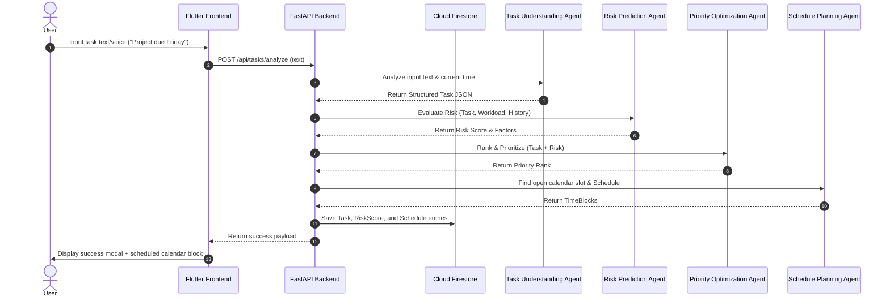
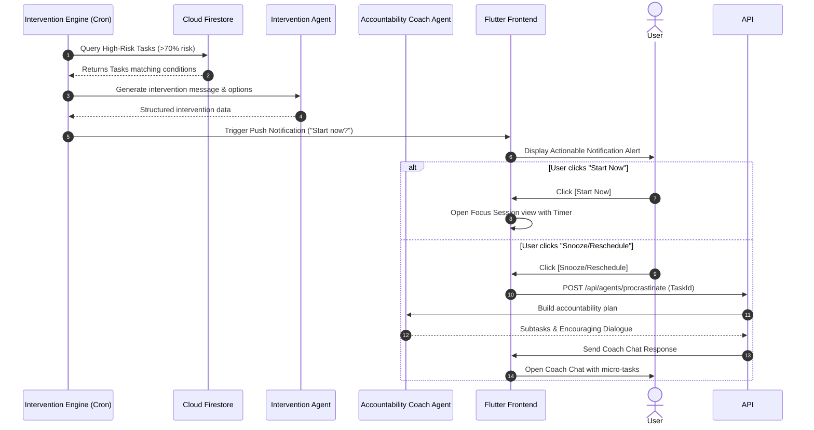
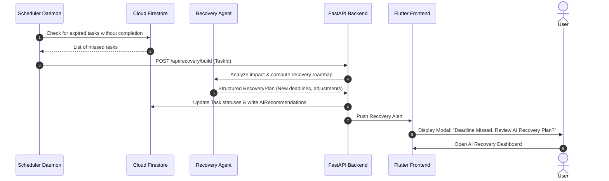

# LifeSaver AI: User Journeys & Sequence Diagrams

This document illustrates the user journeys and sequence diagrams modeling the agent interactions for **LifeSaver AI**.

---

## 1. User Journeys

### 1.1. Student Journey (Assignment Deadlines)
* **User Profile:** Alex, 2nd-year Computer Science Student.
* **Problem:** Procrastinates on large projects, resulting in all-nighters and late submissions.
* **Journey Map:**
  1. **Capture:** Alex receives an assignment outline via email. LifeSaver AI's Gmail integration detects the deadline automatically.
  2. **Parsing:** The Task Understanding Agent extracts the deadline (Friday 11:59 PM) and estimates effort (12 hours).
  3. **Risk Scoring:** The Risk Prediction Agent marks this task with a **85% Risk Score** due to Alex's calendar blocks and historical procrastination trends.
  4. **Scheduling:** The Schedule Planning Agent finds 2-hour free slots on Tuesday, Wednesday, and Thursday and blocks them on Alex's Google Calendar.
  5. **Intervention:** Tuesday afternoon arrives. Alex is playing games. The Intervention Agent sends a high-priority notification: *"You have a scheduled work block for Compiler Project. Start now?"* with a `[Start Now]` action.
  6. **Completion:** Alex clicks `[Start Now]`, entering **Focus Mode**. The app locks out distractions, displays a session timer, and Alex successfully finishes the project by Thursday evening.

---

### 1.2. Working Professional Journey (Meeting & Task Overlap)
* **User Profile:** Sarah, Marketing Director.
* **Problem:** Overloaded calendar causes her to miss preparation tasks for major executive presentations.
* **Journey Map:**
  1. **Capture:** Sarah enters: *"Need to review Q3 slide deck before the board meeting on Thursday morning."*
  2. **Parsing:** The task is scheduled with a dependency on the Slide Deck file availability and a deadline of Thursday 9:00 AM.
  3. **Risk Scoring:** The Risk Prediction Agent notices Sarah has 7 back-to-back meetings on Wednesday, calculating a **90% risk of missed preparation**.
  4. **Dynamic Rescheduling:** The Priority Optimization Agent overrides a low-priority networking sync scheduled on Tuesday and inserts a 90-minute Focus block for Q3 Slide review.
  5. **Outcome:** Sarah completes the preparation during the newly optimized slot. She attends the board meeting fully prepared, completely avoiding a last-minute rush.

---

### 1.3. Entrepreneur Journey (Procrastination & Accountability)
* **User Profile:** Marcus, Tech Startup Founder.
* **Problem:** Puts off unpleasant tasks like taxes, legal filings, and invoice follow-ups.
* **Journey Map:**
  1. **Capture:** A task *"File quarterly business tax return by the 15th"* is imported.
  2. **Risk Scoring:** Risk score climbs to **75%** as the deadline approaches and Marcus keeps snoozing the schedule blocks.
  3. **Accountability Coaching:** The Accountability Coach Agent detects the frequent postponements and pops up a chat widget: *"Marcus, you've snoozed this task three times. Let's break it down. Step 1 is just gathering your invoices. It takes 10 minutes. Can we do just that step now?"*
  4. **Micro-Task Action:** Marcus agrees, clicks `[Do Step 1]`, and once finished, gets a motivational boost to complete the rest of the tax filings in chunks.

---

### 1.4. Freelancer Journey (Missed Bill Payments)
* **User Profile:** Elena, Freelance UI Designer.
* **Problem:** Manages multiple software subscriptions and forgets billing cycles, leading to service disruption.
* **Journey Map:**
  1. **Capture:** Elena imports a PDF invoice for Adobe Creative Suite.
  2. **Parsing:** The Task Understanding Agent extracts: Bill Amount ($55.99), Due Date (June 28), and Category (Billing).
  3. **Intervention:** Two days before the deadline, the Risk Prediction Agent notices Elena's bank auto-pay is not set up. The Intervention Agent pushes a notification: *"Creative Suite bill is due in 48 hours. Pay now to avoid design tool lockout?"* with a direct payment shortcut button.
  4. **Outcome:** Elena clicks the action, pays immediately, and marks it done.

---

## 2. Sequence Diagrams

### 2.1. Multi-Agent Pipeline for Task Creation
Shows the sequence when a user adds a task via voice or text.

---

### 2.2. Interactive Intervention & Accountability Flow
Shows how the system handles procrastination.

---

### 2.3. Task Missed Recovery Flow
Shows how the system acts when a deadline passes.

